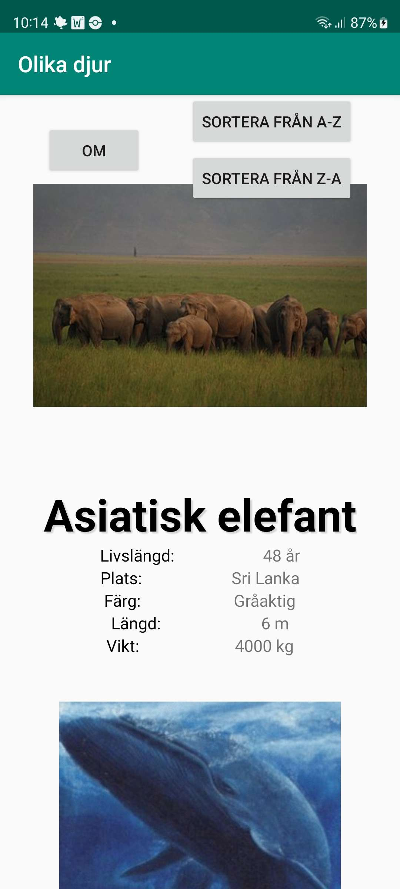
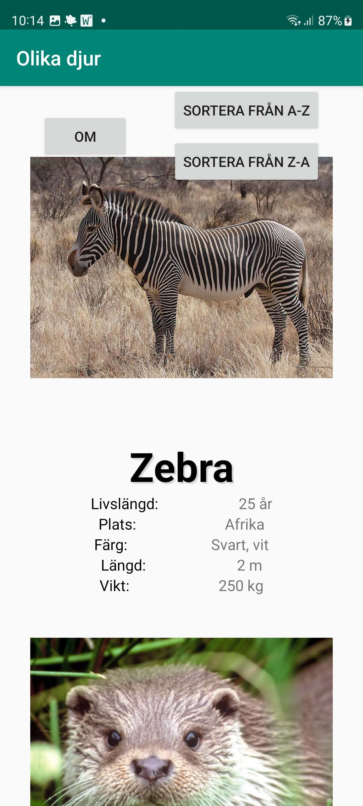
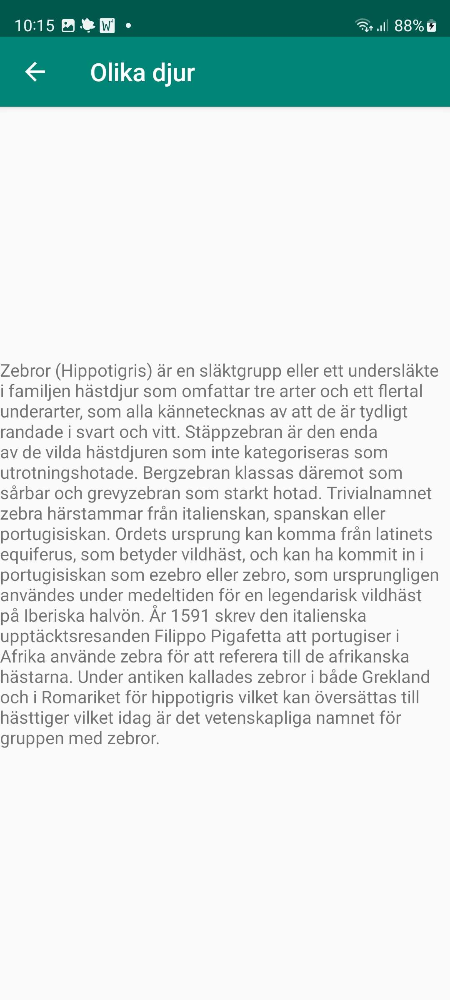
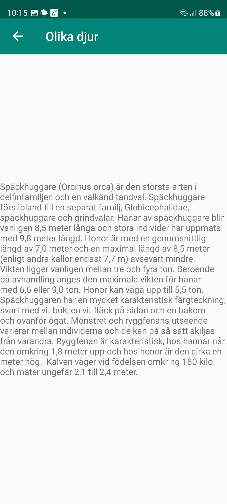
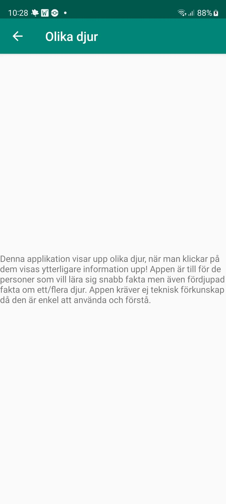

# Rapport

Jag har skapat en applikation som visar upp olika djur med kort information. Klickar man på djuret
visas mer detaljerad information om just det djuret. All data hämtas via JSON och visas upp i en RecyclerView.
Appen har även funktioner för att sortera från A-Z och tvärt om. Det finns även en Om-skärm (About-screen)
som förklarar vad appen är till för och för vilken målgrupp den är menad för.

## Följande grundsyn gäller dugga-svar:

Koden nedan ger applikationen åtkomst till internet.
```
<uses-permission android:name="android.permission.INTERNET"/>
```

Koden nedan hämtar JSON data från länken i variabeln JSON_URL
```
private final String JSON_URL = "https://mobprog.webug.se/json-api?login=a23emijo"; // Link to JSON data

// Executes the JSON download
new JsonTask(this).execute(JSON_URL);
```

Koden nedan sorterar datan från A till Z och tvärt om.
```
// Sort by A to Z
public void sortByAToZ(){
    Collections.sort(items, new Comparator<Animal>() {
        @Override
        public int compare(Animal animal1, Animal animal2) {
            return animal1.getName().compareTo(animal2.getName());
        }
    });
}

// Sort by Z to A
public void sortByZToA(){
    Collections.sort(items, new Comparator<Animal>() {
        @Override
        public int compare(Animal animal1, Animal animal2) {
            return animal2.getName().compareTo(animal1.getName());
        }
    });
}
```

Koden nedan hittar först knapparna via "findViewById" och sätter sedan en OnClickListener för varje knapp.
```
sortByAToZ = findViewById(R.id.sort_A_Z_button); // Finds the button for sorting A to Z
sortByZToA = findViewById(R.id.sort_Z_A_button); // Finds the button for sorting Z to A
about = findViewById(R.id.about_button); // Finds the to second activity button

// Sets a OnClickListener for the AboutActivity button
about.setOnClickListener(new View.OnClickListener() {
    @Override
    public void onClick(View view) {
        // Sets the intent
        startActivity(new Intent(MainActivity.this, AboutActivity.class)); // Starts the activity with the intents
    }
});

myPreferenceRef = getSharedPreferences("mySortPref", MODE_PRIVATE);
myPreferenceEditor = myPreferenceRef.edit();

// Sorts the different elements from A to Z
sortByAToZ.setOnClickListener(new View.OnClickListener() {
    @Override
    public void onClick(View view) {
        recViewAdapter.sortByAToZ();
        recViewAdapter.notifyDataSetChanged();
        myPreferenceEditor.putInt("sortPreference", 1);
        myPreferenceEditor.apply();
    }
});

// Sorts the different elements from Z to A
sortByZToA.setOnClickListener(new View.OnClickListener() {
    @Override
    public void onClick(View view) {
        recViewAdapter.sortByZToA();
        recViewAdapter.notifyDataSetChanged();
        myPreferenceEditor.putInt("sortPreference", 2);
        myPreferenceEditor.apply();
    }
});
```

Koden nedan skapar en array av alla föremål som hämtats.
```
// Creates an array of all the items in Animal
Type type = new TypeToken<ArrayList<Animal>>() {}.getType();
ArrayList<Animal> listOfAnimals = gson.fromJson(json, type);
```

Koden nedan hittar RecyclerViewn och lägger till data i den. Den skickar även auxdatan (som kommer
från JSON-strängen) via en intent från MainActivity till InfoActivity. Koden kommer även ihåg
om A-Z eller Z-A var den senaste sorteringen, det betyder att om man startar om appen är den
senaste sorteringen sparad. Sist av allt upptäcker den även om RecyclerViewn har uppdaterats.
```
// Find the RecyclerView and adds data to it
recViewAdapter = new RecyclerViewAdapter(this, listOfAnimals, new RecyclerViewAdapter.OnClickListener(){
    @Override
    public void onClick(Animal animal) {
        // Sets the intents
        Intent intent = new Intent(MainActivity.this, InfoActivity.class); // Make the intent go from Main- to InfoActivity
        intent.putExtra("auxInfo", animal.getAuxdata().getInfo()); // Gets the auxInfo data
        startActivity(intent); // Starts the activity with the intents
    }
});
recView = findViewById(R.id.recycler_view); // Finds the RecyclerView
recView.setLayoutManager(new LinearLayoutManager(this));
recView.setAdapter(recViewAdapter);

if(saveSort == 1){ // If A-Z was the latest sort
    recViewAdapter.sortByAToZ();
} else if (saveSort == 2){ // If Z-A was the latest sort
    recViewAdapter.sortByZToA();
}
recViewAdapter.notifyDataSetChanged();
```

Koden nedan körs när appen startas igen efter att ha blivit nedstängd.
```
@Override
protected void onResume() {
    super.onResume();
    saveSort = myPreferenceRef.getInt("sortPreference", 0);
}
```

Koden nedan konverterar datan som hämtats via JSON till string.
```
// Converts the data to string
@Override
public String toString() {
    return "Animal{" +
            "name='" + name + '\'' +
            ", age=" + company +
            ", location='" + location + '\'' +
            ", color='" + category + '\'' +
            ", length=" + size + '\'' +
            ", weight=" + cost + '\'' +
            ", auxData=" + auxdata +
            '}';
}
```

Koden nedan konverarar ändast datan som finns i auxdata-strängen i JSON-strängen eftersom auxdata innehåller
två olika taggar, img och info.
```
// Converts the data to string
@Override
public String toString() {
    return "{" +
            "img=" + img + '\'' +
            ", info=" + info +
            '}';
}
```

Koden nedan får positionen för klicket på de olika elementen i recyclerViewn.
```
// Gets the position of the click on the different elements in the RecyclerView
@Override
public void onClick(View view) {
    onClickListener.onClick(items.get(getAdapterPosition()));
}
```

Koden nedan skapar ett interface för onClick på Animal.
```
// Create a interface for onClick on Animal
public interface OnClickListener {
    void onClick(Animal animal);
}
```

Koden nedan sätter de olika värdena i variabler.
```
// Sets the different values
@Override
public void onBindViewHolder(ViewHolder holder, int position) {
    Animal animal = items.get(position);

    // Sets the different values except img and info
    holder.name.setText(animal.getName());
    holder.age.setText(String.valueOf(animal.getCompany() + " år"));
    holder.location.setText(animal.getLocation());
    holder.color.setText(animal.getCategory());
    holder.length.setText(String.valueOf(animal.getSize() + " m"));
    holder.weight.setText(String.valueOf(animal.getCost() + " kg"));

    // Sets the img and info fields values
    if (animal.getAuxdata() != null) {
        // Tries to load the JSON image three times
        Picasso.get().load(animal.getAuxdata().getImg()).into(holder.auxImage);

        // Placeholder that shows before the image is loaded
        Picasso.get().load(animal.getAuxdata().getImg()).placeholder(R.drawable.ic_launcher_background).into(holder.auxImage);

        // Shows if the original image couldn't load after 3 tries
        Picasso.get().load(animal.getAuxdata().getImg()).error(R.drawable.error);
    }
}
```

Koden nedan sätter den hämtade datan på de olika views och lägger även onClick på dem.
```
// Displays the value of the data on the View
ViewHolder(View itemView) {
    super(itemView);
    itemView.setOnClickListener(this);
    name = itemView.findViewById(R.id.name);
    age = itemView.findViewById(R.id.age);
    location = itemView.findViewById(R.id.location);
    color = itemView.findViewById(R.id.color);
    length = itemView.findViewById(R.id.length);
    weight = itemView.findViewById(R.id.weight);
    auxImage = itemView.findViewById(R.id.auxImage);
}
```

Koden nedan hämtar storleken på items listan.
```
// Gets the size of the items list
@Override
public int getItemCount() {
    return items.size();
}
```

Bilden nedan visar hur det ser ut när användaren valt att sorterara från A-Z.


Bilden nedan visar hur det ser ut när användaren valt att sorterara från Z-A.


Bilden nedan visar att om man trycker på ett djur, i detta fall Zebra, visas mer information upp om just det djuret.


Bilden nedan visar ett till exempel på hur det ser ut, här har användaren tryckt på djuret späckhuggare.


Bilden nedan visar Om-skärmen som förklarar vad applikationen är till för och för vilken målgrupp den är menad för.

